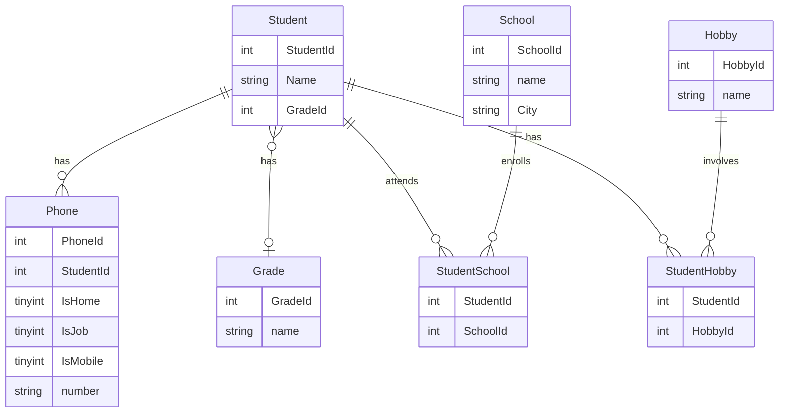

# db2022

> ### Normalisera databas
>
> 1. Start docker container in bash:
>
> docker pull mysql/mysql-server:latest
>
> docker run --name iths-mysql\
>           -e MYSQL_ROOT_PASSWORD=root\
>           -e MYSQL_USER=chris\
>           -e MYSQL_PASSWORD=iths\
>           -e MYSQL_DATABASE=iths\
>           -p 3306:3306\
>           -d mysql/mysql-server:latest
>
> 2. Download file with denormalized data to workspace:
>
> curl -L  https://gist.github.com/miwashiab/d891a64c7f73f4c8c3b5cfee2b3de776/raw/denormalized-data.csv -o denormalized-data.csv
>
> 3. Move denormalized data to docker container:
> docker cp denormalized-data.csv iths-mysql:/var/lib/mysql-files
> 				      ^
>			   (container-with-mysql)
>
> 4. Check file have been correctly copied and add privileges for database iths:

> - winpty docker exec -it iths-mysql bash
>
> (Inside docker bash)
> cd /var/lib/mysql-files
>
> - mysql -uchrus -piths

> (Inside docker mysql)
> SHOW GRANTS FOR iths;
> GRANT ALL PRIVILEGES ON iths.* TO 'chris'@'%';
> GRANT FILE ON *.* TO 'chris'@'%';

